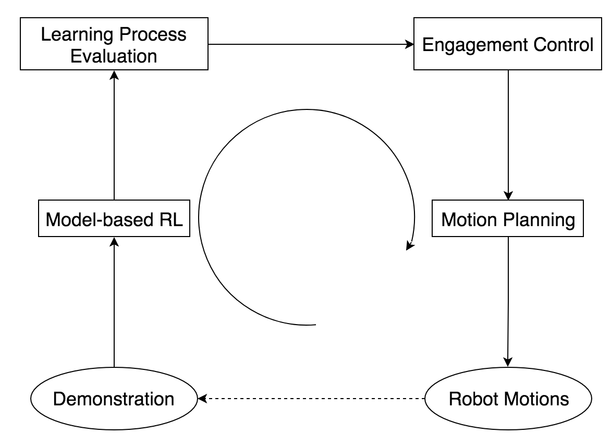
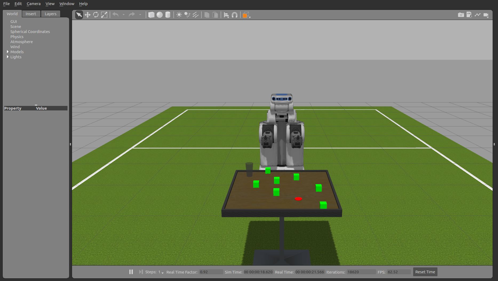
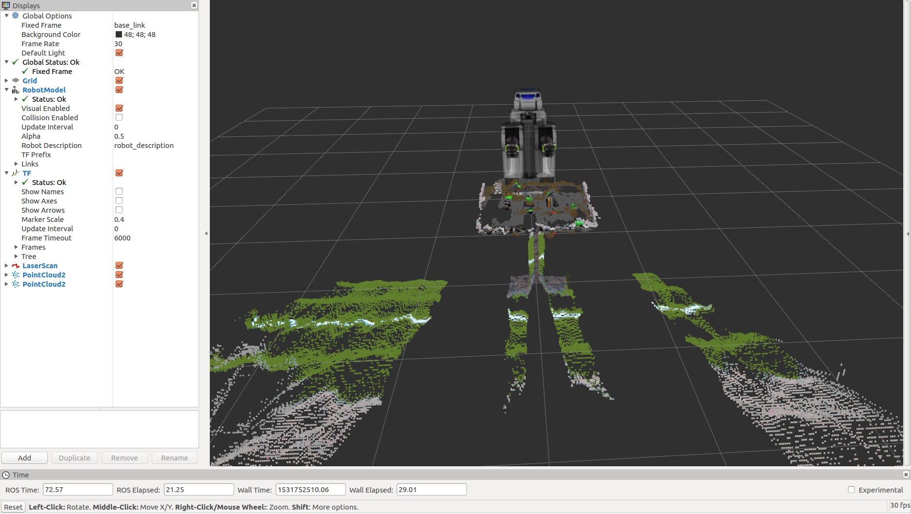
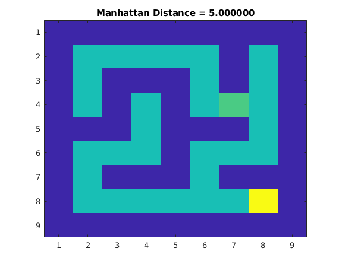
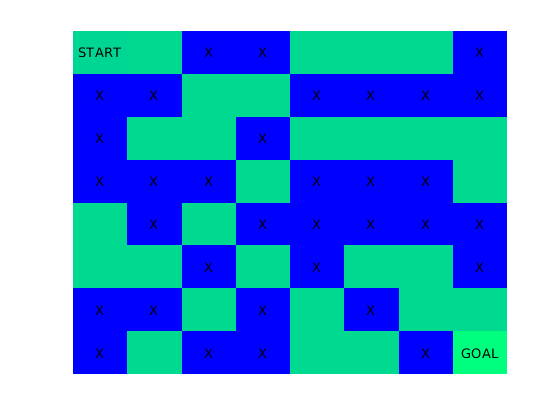
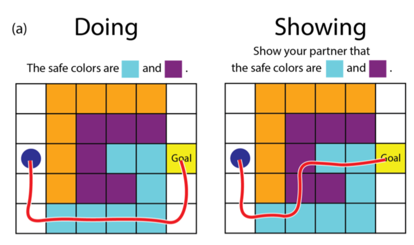

# RLfD_robot-motions
Robot motions in Learning from Demonstration

* To find out what kind of robot motions will affect future demonstrations

Related robot motion types: attentional motions? uncertainty motions? predicatable motions?

* To know how those robot motions influence the demonstrations (positive or negative?)

Possible influences: how the learning process evolve over time? the state visited, the values updated

# Overview

**Tentative schedule**: 

1. Demonstration (Jun 15th)

2. Model-based RL (Jul 1st)
* [Q-Learning](https://github.com/mingfeisun/matlab-reinforcement-learning/tree/master/RL-Q-Learning/Reinforcement%20Learning(Q-Learning))

**Autonomous Q-learning** test on the simulation:

* [SARSA](https://github.com/mingfeisun/matlab-reinforcement-learning/tree/master/SARSA)

**To be decided**

To-do list:
* State: pose (position & orientation), velocity, physical properties etc. 
* Reward: -1 for each movment until reach final goal, -? for collision, 0 for reach final goal, object pose

3. Learning process evaluation (Jul 15th)

**Q-learning**:
* Q function update (update for current state and action only)
* Predicted action vs. human input action

4. Engagement control (Jul 20th)
5. Motion planning (Jul 25th)

**To-do lists**:

1. Need to find out the possible robot motions that would affect the human perception
2. Need to implement the related motions
3. Need to determine the learning model and evaluate the model effects towards the learning

# Expected outcome

# Misc

## Related work

## Related source code
[Matlab Reinforcement Learning](https://github.com/mingfeisun/matlab-reinforcement-learning)
